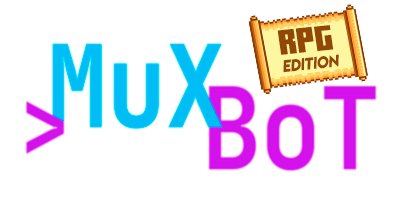

<p align=center>
  
  <br>
  <span><strong>MuXBoT RPG</strong><br> A simply BoT for Discord with RPG functions.<br>
    <sub>Built with ❤︎ by
      <a href="https://github.com/juananmuxed">MuXeD</a>
    </sub>
</p>

  [](https://github.com/juananmuxed/muxbot-rpg/blob/master/LICENSE) [](https://discord.gg/UnBtckE) 
---

# 🤔 What is MuXBoT RPG
MuXBoT is a little bot for play in Discord to RPG games. A project to roll dices, have a good ambient music, and other future stuffs.

## 💻 Commands

### 🎲 **Roll Dices**
Used to roll all number of dices of any type (included unorthodox numbers like 17).
You have an option to launch dices secretly with the last arguments. If not, is public.

Two languages, english and spanish. The bot answer you in de command language. It's polite.

```bash
/dice 
Options
dices: number of dices
faces: number of faces
modification: number positive or negative to modify rolls
secret: just you see the results
```

**Examples**
```bash
/dice dices: 3 faces: 20
```

🤖 _Output_

```bash
Roll 3 of 20
Results
[18,3,4]
Add
2
Individual Sum
[20,5,6]
Sum
25+2=27
```

### 🎷 **Music**
This commands is for ambient all your games. Use Youtube and your ****ing imagination.
You can add music or search directly. 

This add to queue
```bash
/play
Options:
query: a query search
```
This skip the actual song, if not other song, is like /stop command
```bash
/skip
```
This stop the queue and finalize the stream.
```bash
/stop
```
This pause the actual song. Use /resume to continue.
```bash
/pause
```
This resume the actual song.
```bash
/resume
```
This show a list of all the songs in the queue and the song actually sound.
```bash
/queue
```
Set the volume of actual song. The ```<volume>``` must be between 1 and 100
```bash
/volume <volume>
```

🇪🇸 **Versiones en Español**
```bash
/dado
/reproducir
/saltar
/parar
/pausa
/continuar
/lista
/volumen
```
El **BoT** te contesta en Español 😱

---

## 🍰 Contributing
Please read [CONTRIBUTING](CONTRIBUTING.md) for details on our [CODE OF CONDUCT](CODE_OF_CONDUCT.md), and the process for submitting pull requests.

---

## 🥪 Installation

**NOTE**: NodeJS 12.0.0 or higher is required.

```bash
# Clone the repo
$ git clone https://github.com/juananmuxed/muxbot-rpg.git

# Change the working directory to muxbot-rpg
$ cd muxbot-rpg
```
If you are interested in up to Heroku or other services. You need to push a master to Heroku and configure the variables from .env in Heroku (i.e.)

---

## 📜 Configuration 
Before running the software we have to add a minimum configuration to our project.

First we are going to create a file that contains our variables, this file must be a **.env**
``./.env``

``` env
DISCORD_TOKEN=DISCORD_GENERATED_FOR_THE_BOT
GUILD_ID=ID_FROM_YOUR_SERVER_DISCORD
```
If you deploy your bot in Heroku or other services, this Variables must be set manually in the configuration of the project.

---

## 🈳 Languages
The bot know 2 languages, English and Spanish, but you can add any .ts Language folder with the strings and commands to translate. 

## 🧠 Usage
**Now we are ready to run the software in local**. Open your terminal.

**NOTE**: Nodemon is required `npm i -g nodemon`.
``` bash
# Terminal
$ cd /yourprojectpath
# install the dependencies
$ npm install
# run node 
$ npm run dev
```

---

## 📂 Repositories
- [Discord.js](https://github.com/discordjs/discord.js)
- [DisTube](https://distube.js.org)
- [RPG Utils](https://www.npmjs.com/package/@muxed/rpg-utils)
- [FFMPEG](https://www.npmjs.com/package/ffmpeg-static)
- [dotenv](https://www.npmjs.com/package/dotenv)

## 🚀 Deployment utils
- [PM2](https://pm2.keymetrics.io/)

---

## 📝 License
This project is under MIT - Details [MIT Licence](https://github.com/juananmuxed/muxbot-rpg/blob/master/LICENSE)

MIT © [MuXeD](https://muxed.es/)
